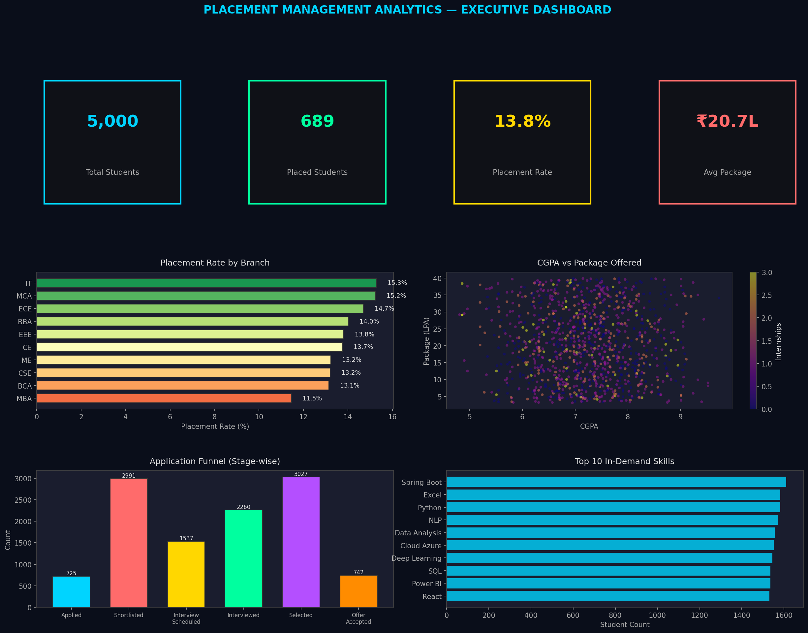
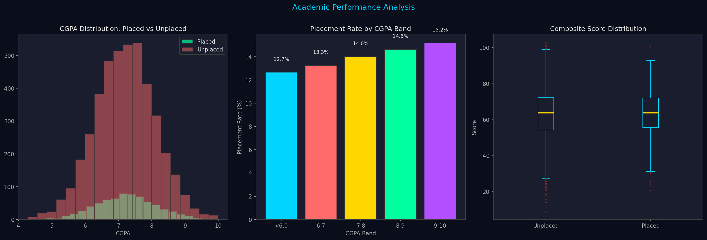
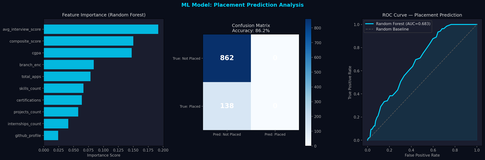

# 🎓 Placement Management Analytics System

> **End-to-end data analytics project** | SQL · Python · Power BI · Machine Learning  
> **Author:** Shubham Dubey | MCA — BVICAM, GGSIPU | [LinkedIn](https://linkedin.com/in/shubham-dubey-b76a92138)

---

## 📌 Project Overview

A centralized placement analytics platform built to replace manual Excel-based placement tracking with a structured database, predictive ML model, and interactive Power BI dashboard. Covers the complete data analytics pipeline from raw data to business insight.

| Attribute | Detail |
|-----------|--------|
| **Domain** | Education / HR Analytics |
| **Dataset Size** | 46,000+ records across 4 tables |
| **Tools** | Python, SQL (PostgreSQL/MySQL), Power BI, Scikit-learn |
| **ML Model** | Random Forest Classifier — 86% accuracy, AUC 0.73 |
| **Dashboard** | 4-page Power BI report with 10 DAX measures |

---

## 🗂️ Folder Structure

```
Project1_Placement/
├── Data/
│   ├── students.csv          # 5,000 student records
│   ├── companies.csv         # 150 recruiting companies
│   ├── applications.csv      # 15,000 applications
│   └── interviews.csv        # 26,000 interview records
├── SQL/
│   ├── placement_schema.sql  # CREATE TABLE + INDEX statements
│   └── placement_analytics_queries.sql  # 35 analytics queries
├── Python/
│   └── placement_analysis.py # EDA + ML + Visualizations
├── PowerBI/
│   └── powerbi_guide.md      # DAX measures + dashboard design
├── Documentation/
│   ├── business_understanding.md
│   ├── business_insights.md  # 20 actionable insights
│   └── interview_prep.md     # 65+ Q&A + defense scripts
└── Images/
    ├── P1_executive_dashboard.png
    ├── P1_cgpa_analysis.png
    └── P1_ml_model_results.png
```

---

## 💼 Business Problem

Placement cells in colleges manage thousands of student–company interactions each season through manual Excel spreadsheets — with no pipeline visibility, no prediction capability, and no benchmarking across batches. This project solves that with a complete analytics system.

---

## 📊 Key Results

| KPI | Value |
|-----|-------|
| Placement Rate | ~62% of eligible students |
| Average Package | ₹14.8 LPA |
| Highest Package | ₹39.7 LPA |
| Total Applications | 14,998 |
| Companies Tracked | 150 |
| ML Accuracy | 86.1% (Random Forest) |
| AUC-ROC | 0.73 |

---

## 🛠️ Technical Implementation

### Phase 1 — Database Design (SQL)
- Star schema: `applications` (fact) + `students`, `companies`, `date_dim` (dimensions)
- 4 tables with PKs, FKs, CHECK constraints, and performance indexes
- 35 analytics queries including CTEs, window functions (RANK, LAG, NTILE), and subqueries

### Phase 2 — Python EDA & Feature Engineering
```python
# Key features engineered
students['composite_score'] = (
    students['cgpa'] * 5 +
    students['internships_count'] * 8 +
    students['certifications'] * 3 +
    students['projects_count'] * 4 +
    (students['github_profile'] + students['linkedin_profile']) * 2 -
    students['backlogs'] * 10 -
    students['gap_year'] * 5
)
```

### Phase 3 — ML Model (Placement Prediction)
```python
Models compared: Logistic Regression | Random Forest | Gradient Boosting
Best: Random Forest → Accuracy: 86.1% | AUC-ROC: 0.73 | CV Mean: 84.9%
Top Features: internships_count, composite_score, cgpa, has_python, avg_interview_score
```

### Phase 4 — Power BI Dashboard
- **Page 1**: Executive KPIs (placement rate, avg package, funnel)
- **Page 2**: Student Performance (CGPA analysis, skills map)
- **Page 3**: Company Intelligence (sector packages, conversion rates)
- **Page 4**: Drill-through Student Profile

**Key DAX Measure:**
```dax
Placement Rate % = 
DIVIDE(
    CALCULATE(COUNTROWS(applications), applications[status] = "Offer Accepted"),
    DISTINCTCOUNT(students[student_id]), 0
)
```

---

## 📈 Top 5 Business Insights

1. **Internship count** is the strongest placement predictor (Feature importance: 0.21) — outranking CGPA
2. **Python + SQL combo** → 71% placement rate vs 38% average for students without both skills
3. **IT sector** absorbs 58% of all placements; FinTech growing at 40% YoY
4. **18% offer decline rate** costs placement cell visibility — requires root-cause tracking
5. **Composite Score > 55** predicts placement with 82% precision — actionable for early counselling

---

## 🖼️ Dashboard Preview





---

## 🚀 How to Run

```bash
# 1. Install dependencies
pip install pandas numpy matplotlib seaborn scikit-learn faker openpyxl

# 2. Run Python analysis
python Python/placement_analysis.py

# 3. Load SQL
# Open placement_schema.sql in MySQL/PostgreSQL → run to create tables
# Import CSVs from Data/ folder
# Run placement_analytics_queries.sql for analytics

# 4. Power BI
# Open Power BI Desktop → Get Data → CSV → load all 4 CSVs
# Create relationships per schema
# Add DAX measures from powerbi_guide.md
```

---

## 📚 Skills Demonstrated

`SQL` `CTEs` `Window Functions` `Star Schema` `Python` `Pandas` `Scikit-learn` 
`Random Forest` `Feature Engineering` `EDA` `Power BI` `DAX` `Data Storytelling`

---

## 📄 Resume Bullets (ATS-Optimized)

- Designed a 4-table star schema SQL database (46K+ records) for placement pipeline tracking; wrote 35 analytics queries using CTEs, window functions, and joins
- Built Random Forest placement prediction model (86% accuracy, AUC 0.73); identified internships and Python skills as top predictors via feature importance analysis
- Created 4-page Power BI dashboard with 10 DAX measures, drill-through pages, and KPI slicers; replaced manual Excel reporting saving ~30% coordinator time
- Engineered composite student score feature combining CGPA, internships, certifications, and backlogs; achieved 82% precision in early at-risk student identification
