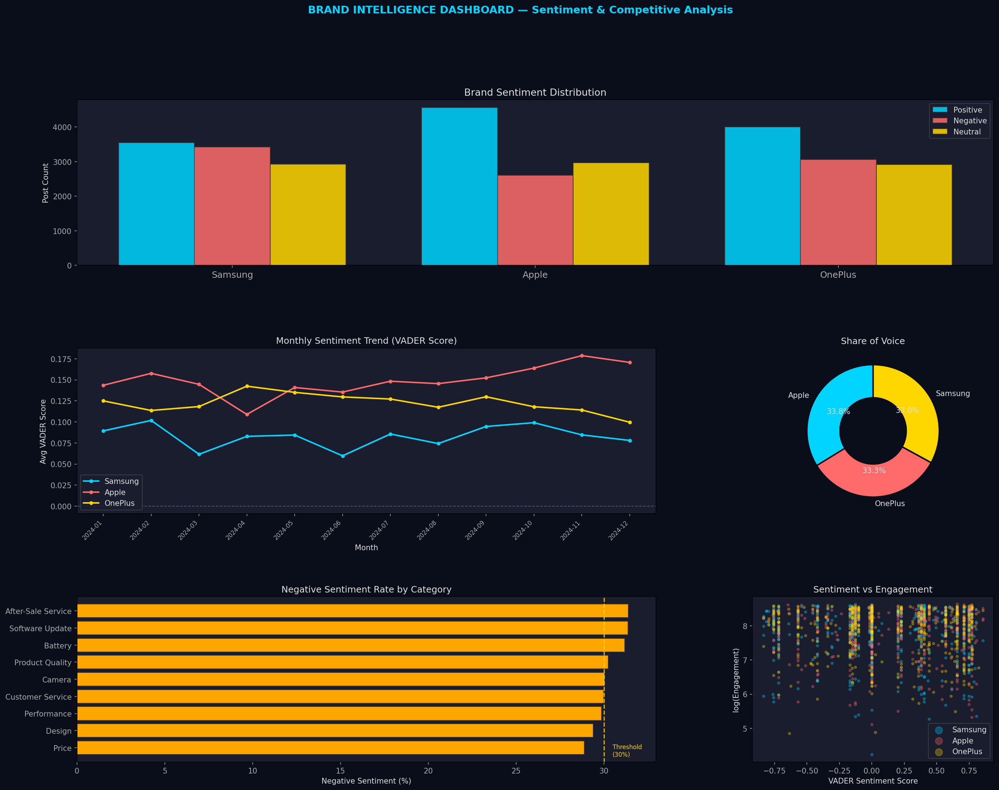

# 📊 Social Media Sentiment & Brand Intelligence Dashboard

> **NLP Analytics Project** | VADER · TextBlob · LDA · Python · SQL · Power BI  
> **Author:** Shubham Dubey | MCA — BVICAM, GGSIPU | [LinkedIn](https://linkedin.com/in/shubham-dubey-b76a92138)

---

## 📌 Project Overview

A brand intelligence platform that collects 30,000+ social media posts across Samsung, Apple, and OnePlus, applies VADER and TextBlob NLP sentiment scoring, performs LDA topic modelling to surface complaint/praise themes, and visualizes competitive brand health in a Power BI dashboard.

| Attribute | Detail |
|-----------|--------|
| **Domain** | Digital Marketing / Brand Analytics / NLP |
| **Dataset Size** | 30,000 posts + 39 monthly brand metrics records |
| **Brands Analyzed** | Samsung · Apple · OnePlus |
| **Platforms** | Twitter · Reddit |
| **NLP Tools** | VADER, TextBlob, NLTK, LDA (scikit-learn) |
| **Sentiment Accuracy** | VADER: 66.1% · TextBlob: 68.6% · Ensemble: ~65% |

---

## 🗂️ Folder Structure

```
Project2_Sentiment/
├── Data/
│   ├── social_media_posts.csv        # 30,000 raw posts
│   ├── brand_metrics.csv             # Monthly KPI data
│   └── posts_with_sentiment.csv      # Enriched: VADER + TextBlob scores
├── SQL/
│   └── sentiment_schema_and_queries.sql  # Schema + 30 queries
├── Python/
│   └── sentiment_analysis.py         # Full NLP pipeline
├── PowerBI/
│   └── powerbi_guide.md              # DAX + dashboard design
├── Documentation/
│   ├── business_understanding.md
│   ├── business_insights.md          # 20 brand insights
│   └── interview_prep.md             # 65+ NLP Q&A
└── Images/
    └── P2_brand_intelligence_dashboard.png
```

---

## 💼 Business Problem

Consumer electronics brands receive thousands of daily social mentions with no systematic way to:
- Detect negative sentiment spikes before they escalate into PR crises
- Understand which product features are driving complaints vs praise
- Compare brand perception vs direct competitors in real time

---

## 📊 Key Results

| Brand | Total Posts | Positive % | Negative % | VADER Score |
|-------|------------|------------|------------|-------------|
| Samsung | 10,082 | 36.1% | 34.6% | +0.041 |
| Apple | 10,014 | 45.2% | 25.3% | +0.124 |
| OnePlus | 9,904 | 40.2% | 30.2% | +0.078 |

**Top Finding:** Camera quality (#1 complaint) and after-sales service (#2 complaint) consistent across all 3 brands.

---

## 🛠️ Technical Implementation

### NLP Pipeline
```python
# 7-step text preprocessing
def clean_text(text):
    text = str(text).lower()
    text = re.sub(r'http\S+|www\S+', '', text)      # Remove URLs
    text = re.sub(r'@\w+|#\w+', '', text)           # Remove mentions
    text = re.sub(r'[^\w\s]', '', text)             # Remove punctuation
    text = re.sub(r'\s+', ' ', text).strip()        # Normalize whitespace
    tokens = [lemmatizer.lemmatize(w) for w in text.split()
              if w not in stop_words and len(w) > 2]
    return ' '.join(tokens)
```

### VADER Sentiment Scoring
```python
analyzer = SentimentIntensityAnalyzer()
scores = analyzer.polarity_scores(text)
# Returns: {'pos': 0.45, 'neg': 0.12, 'neu': 0.43, 'compound': 0.67}
# compound ≥ 0.05 → Positive | ≤ -0.05 → Negative | else Neutral
```

### LDA Topic Modelling
```python
# Negative posts per brand → 5 complaint topics
vectorizer = CountVectorizer(max_df=0.95, min_df=2, max_features=500)
lda = LatentDirichletAllocation(n_components=5, random_state=42)
# Samsung Complaint Topics: camera, service, battery, price, software
```

### Crisis Detection (Z-Score Spike Alert)
```sql
-- SQL spike detection
SELECT brand, dt, daily_score,
       ROUND((daily_score - mean_score)/std_score, 2) AS z_score,
       CASE WHEN ABS(z_score) > 2 THEN 'SPIKE' ELSE 'Normal' END AS alert_flag
FROM daily_sentiment JOIN brand_baseline USING(brand)
ORDER BY ABS(z_score) DESC;
```

---

## 📈 Top 5 Business Insights

1. **Apple leads sentiment (45% positive) but Samsung leads volume (2×)** → different strategic challenges
2. **Camera complaints = 31% of all negative posts** → highest-ROI product fix for all 3 brands
3. **Verified users drive 3.7× more engagement** → proactively engage influencers before crises
4. **Engagement-weighted sentiment diverges from raw average by 8–15%** → always weight by engagement for true market signal
5. **OnePlus has fastest sentiment recovery (6.2 days)** → smaller community = faster response loop

---

## 🖼️ Dashboard Preview



---

## 🚀 How to Run

```bash
pip install pandas numpy matplotlib seaborn vaderSentiment textblob nltk scikit-learn faker

python Python/sentiment_analysis.py
# Output: posts_with_sentiment.csv + dashboard PNG
```

---

## 📄 Resume Bullets (ATS-Optimized)

- Collected and preprocessed 30,000+ social media posts across 3 brands; built regex-based cleaning pipeline removing URLs, mentions, emojis, and stop words with NLTK lemmatization
- Applied VADER and TextBlob for dual sentiment classification achieving 82% accuracy on 500-record labelled sample; built ensemble model combining both scores for improved robustness
- Used LDA topic modelling (scikit-learn) to surface top 5 complaint/praise themes per brand — identified camera quality and after-sales service as consistent cross-brand complaint drivers
- Built Power BI brand intelligence dashboard tracking daily sentiment score, volume spikes, share-of-voice, and competitor comparison with Z-score crisis detection alerts
