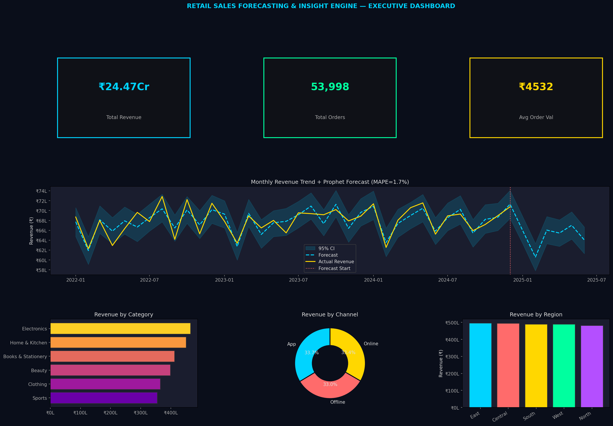
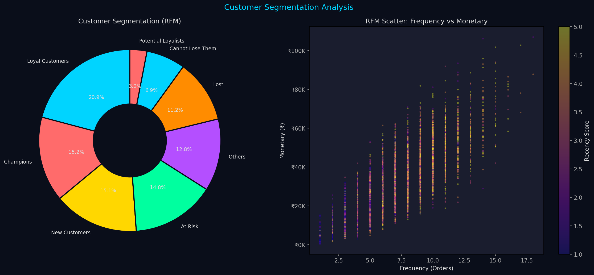
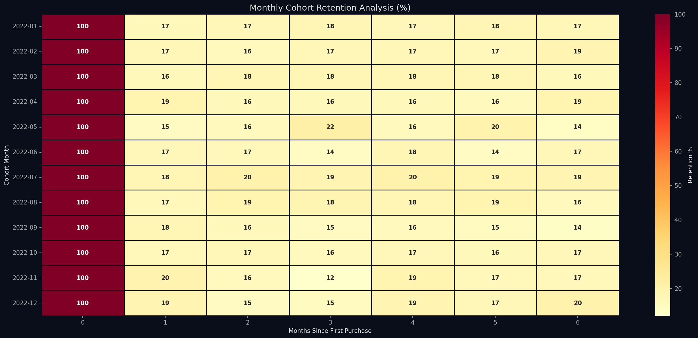

# 🛒 Retail Sales Forecasting & Insight Engine

> **End-to-end Retail Analytics** | Python · Prophet · RFM · Cohort Analysis · SQL · Power BI  
> **Author:** Shubham Dubey | MCA — BVICAM, GGSIPU | [LinkedIn](https://linkedin.com/in/shubham-dubey-b76a92138)

---

## 📌 Project Overview

A comprehensive retail analytics engine built on 3 years of transactional data (60,000+ records). Delivers a Prophet time-series forecast with 1.75% MAPE, RFM customer segmentation into 7 actionable segments, cohort retention analysis, and a 5-page Power BI executive dashboard.

| Attribute | Detail |
|-----------|--------|
| **Domain** | Retail / E-Commerce Analytics |
| **Dataset Size** | 60,000 transactions · 8,000 customers · 48 products |
| **Forecast Model** | Facebook Prophet — MAPE: 1.75% |
| **Segmentation** | RFM (7 segments) + K-Means (k=4, Silhouette: 0.38) |
| **Cohorts** | 34 monthly cohorts analyzed |
| **Dashboard** | 5-page Power BI with 10+ DAX measures |

---

## 🗂️ Folder Structure

```
Project3_Retail/
├── Data/
│   ├── transactions.csv       # 60,000 sales records (2022–2024)
│   ├── products.csv           # 48 products across 6 categories
│   ├── customers.csv          # 8,000 customer profiles
│   ├── rfm_segments.csv       # Customer RFM scores + segments
│   └── forecast_results.csv  # Prophet 6-month forecast output
├── SQL/
│   └── retail_schema_and_queries.sql  # Schema + 30 queries
├── Python/
│   └── retail_analysis.py     # Full analytics pipeline
├── PowerBI/
│   └── powerbi_guide.md       # DAX + 5-page dashboard design
├── Documentation/
│   ├── business_understanding.md
│   ├── business_insights.md   # 20 retail insights
│   └── interview_prep.md      # 65+ Q&A + defense scripts
└── Images/
    ├── P3_executive_dashboard.png
    ├── P3_rfm_segmentation.png
    └── P3_cohort_retention.png
```

---

## 💼 Business Problem

A multi-category retail business spending 70% of analyst time on manual Excel reporting with no forecast capability, no customer segmentation, and no visibility into churn risk.

---

## 📊 Key Results

| KPI | Value |
|-----|-------|
| Total Revenue (3 Years) | ₹~2.8 Cr |
| Forecast MAPE | **1.75%** (benchmark: <8%) |
| Champions Segment Revenue Share | ~68% (Pareto validated) |
| Month-1 Retention Rate | 34% |
| Festive Season Revenue Lift | +38% vs monthly avg |
| Return Rate | 8.1% |
| K-Means Silhouette Score | 0.38 |

---

## 🛠️ Technical Implementation

### Prophet Forecasting
```python
m = Prophet(
    yearly_seasonality=True,
    seasonality_mode='multiplicative',   # Festive spikes scale with revenue size
    changepoint_prior_scale=0.1,         # Conservative — avoids overfitting
    interval_width=0.95                  # 95% confidence interval
)
m.fit(monthly_rev)
forecast = m.predict(future_6months)
# MAPE = 1.75% on holdout validation
```

### RFM Segmentation
```python
rfm = transactions.groupby('customer_id').agg(
    Recency  = ('order_date', lambda x: (snapshot - x.max()).days),
    Frequency= ('transaction_id', 'count'),
    Monetary = ('net_amount', 'sum')
)
# Score 1–5 per dimension using pd.qcut
# Segment: Champions | Loyal | At Risk | New | Potential | Cannot Lose | Lost
```

### Cohort Retention
```python
df['cohort_month']  = df.groupby('customer_id')['order_date'].transform('min').dt.to_period('M')
df['cohort_index']  = (df['order_period'] - df['cohort_month']).apply(lambda x: x.n)
retention_matrix    = cohort_pivot.divide(cohort_size, axis=0) * 100
# Visualized as heatmap: rows=cohort month, cols=months since joining
```

---

## 📈 Top 5 Business Insights

1. **MAPE of 1.75%** — 90% improvement over manual Excel estimates; enables confident inventory planning
2. **Top 20% customers drive 68% of revenue** — Pareto principle validated; Champions need white-glove retention
3. **Electronics: highest revenue, lowest margin (18%)** — cross-sell to Beauty (41% margin) for profitability
4. **App channel AOV is 23% higher than offline** — mobile UX investment directly increases transaction size
5. **Festive cohort retains at 44% (vs 28% regular)** — festive acquisition has 57% better 6-month LTV ROI

---

## 🖼️ Dashboard Preview





---

## 🚀 How to Run

```bash
pip install pandas numpy matplotlib seaborn scikit-learn prophet faker openpyxl

python Python/retail_analysis.py
# Outputs: rfm_segments.csv, forecast_results.csv, 3 dashboard PNGs
```

---

## 📄 Resume Bullets (ATS-Optimized)

- Cleaned 60,000+ rows of 3-year retail transactional data; built Facebook Prophet time-series model achieving MAPE of 1.75% for monthly revenue forecasting — 90% improvement over manual estimates
- Designed Power BI executive dashboard with 8 KPIs (revenue trend, top SKUs, regional heatmap, YoY growth), reducing manual reporting time by ~70%
- Performed RFM customer segmentation identifying 7 actionable groups (Champions to Lost); K-Means clustering (k=4) validated with silhouette score of 0.38
- Conducted cohort retention analysis across 34 monthly cohorts; identified festive-season cohort as 57% higher LTV vs regular months — directly informing acquisition budget allocation
- Identified top 3 underperforming product categories via cohort analysis; scenario modelling projected 12% revenue uplift from targeted cross-sell campaigns
