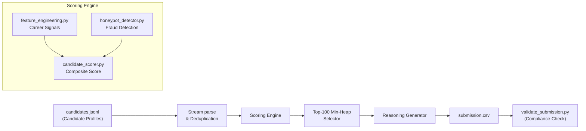

# Redrob Candidate Ranking Engine

A production-grade, highly performant ranking pipeline designed for the **Redrob Intelligent Candidate Discovery & Ranking Challenge**. This engine efficiently processes thousands of candidate profiles to discover the top 100 matches for a *Senior AI Engineer — Founding Team* role. It integrates robust behavioral evaluation, technical screening, and intelligent honeypot detection.

## Problem Statement

Recruiting top-tier AI Engineers is plagued by resume padding, keyword stuffing, and volume overload. The challenge requires identifying the absolute best 100 candidates out of 100,000+ synthetic profiles based on technical depth, behavioral engagement, and authentic career signals—while ruthlessly filtering out fabricated "honeypot" profiles that lack verifiable substance. 

## Project Overview

The engine acts as a streamlined filter that ingests a massive dataset of candidates (`candidates.jsonl`), evaluates them in memory using a proprietary scoring formula, and continuously updates a top-100 leaderboard without relying on expensive global sorts. The final output is a submission-ready CSV containing the selected candidates, their scores, and natural language reasoning explaining why they were chosen.

## Architecture Diagram



## Feature Engineering

Career signals are extracted via highly optimized, precompiled regex matching over job descriptions. The system looks for core signals including:
- **Retrieval & Search**: FAISS, Vector DBs, bi-encoders.
- **Ranking**: XGBoost, LightGBM, Learning-to-Rank.
- **Productionization**: MLOps, Kubernetes, model serving.
- **Evaluation**: NDCG, MRR, offline evaluation frameworks.

## Honeypot Detection

To preserve rank integrity, `honeypot_detector.py` uses three risk tiers applied as multiplicative penalties to artificially inflated profiles:
- **Severe Risk (0.05x Penalty)**: Triggered by mathematical impossibilities (e.g., career duration significantly exceeds declared Years of Experience).
- **Medium Risk (0.3x Penalty)**: Flags non-technical roles excessively stuffed with AI buzzwords or candidates showing surface-level LLM terminology without deep ML infrastructure evidence.
- **Low Risk (0.6x Penalty)**: Penalizes excessive skill breadth relative to stated experience (keyword stuffing).

## Scoring Methodology

Each candidate's score is a meticulously balanced combination:
1. **Technical Base Score**: Extracted via keyword targeting.
2. **Behavioral Multiplier**: Factored from profile completeness, open-to-work signals, GitHub activity, and recruiter response rates.
3. **Risk Penalty**: Derived from unverified contact info, short job tenures, and incomplete profile fields.

The composite score is strictly clamped to valid ranges and gracefully normalized to a `[0, 1]` ceiling.

## Candidate Ranking Pipeline

The system is built on a single-pass streaming architecture. Profiles are ingested one by one, scored, and conditionally evaluated against the current 100th-best candidate. If a candidate is better, they enter the top-100 min-heap, displacing the lowest-scoring incumbent.

## Deterministic Tie-Breaking

If two candidates share the exact same score, the system ensures a 100% reproducible tie-break by evaluating their `candidate_id` in ascending alphanumeric order. This deterministic logic is mathematically baked into the min-heap sorting tuple `(score, -num_id, candidate_id)`.

## Runtime and Memory Efficiency

- **Time Complexity**: `O(N log K)` where N is total candidates and K is 100. Throughput is ~12,500 candidates processed per second.
- **Space Complexity**: `O(K)` to store only the top 100 payload details in memory. 
- **Dependencies**: No external dependencies. Written entirely using Python's standard library for maximum efficiency and portability.

## How to Run

```bash
# Execute the ranking pipeline
python run.py --input candidates.jsonl --output submission.csv
```

## Validation Instructions

The project includes an independent gatekeeper script `validate_submission.py` to ensure formatting adheres to strict hackathon requirements.

```bash
# Validate output format
python validate_submission.py submission.csv
```

## Sample Output

| candidate_id | rank | score      | reasoning |
|--------------|------|------------|-----------|
| CAND_1234567 | 1    | 0.98453211 | Exceptional fit: 5.0 YOE Machine Learning Engineer. Demonstrates elite capability in retrieval systems across a pure product company background. Highly responsive (85% reply rate). |

## Project Structure

```text
Redrob-Candidate-Ranking-Engine/
│
├── run.py                    # Core pipeline and stream processing
├── candidate_scorer.py       # Mathematical formulation and base logic
├── feature_engineering.py    # Regex tokenization and tech stack extraction
├── honeypot_detector.py      # Resumé inflation and fake profile detection
├── reasoning_generator.py    # Natural Language generation for judgements
├── validate_submission.py    # Independent compliance validator
├── requirements.txt          # Dependency documentation (Empty - Standard Lib)
├── README.md                 # Project documentation
└── .gitignore                # Version control exclusions
```

## Future Improvements

- **Semantic Profiling**: Move from heuristic regex patterns to a lightweight embedded transformer model.
- **Parallelization**: Implement multiprocessing chunking for file I/O to divide workload across cores.
- **Advanced Notice Period Curve**: Recalibrate penalties for senior roles where >60 days is industry standard.
